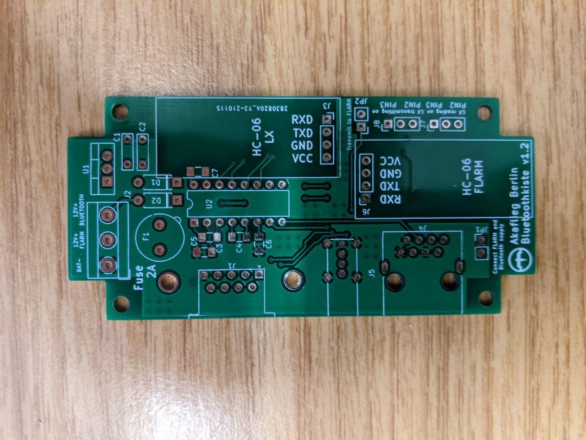
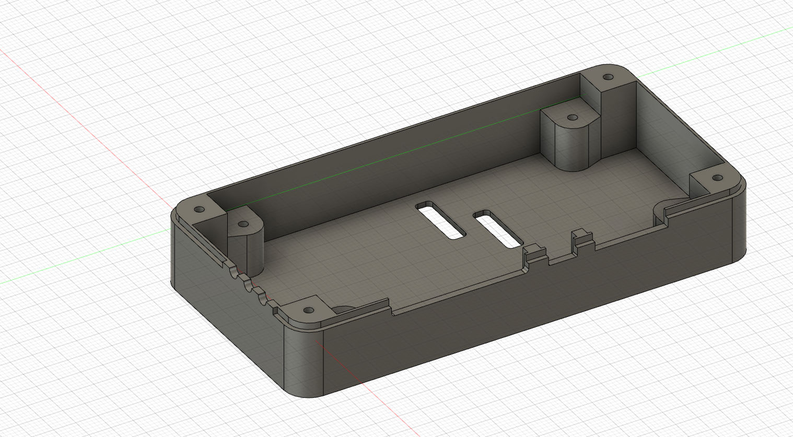

# Bluetoothkiste

Bluetooth-Box für Segelflugzeuge zur Kommunikation zwischen Smartphone (mit beispielsweise XCSoar) und LX (5000/7000/7007) sowie FLARM. LX und FLARM senden über zwei getrennte Bluetooth-Module, werden also als zwei unterschiedliche Serialports auf dem Smartphone sichtbar. Das FLARM wird über den breiten RJ45-Westernstecker an die Box angeschlossen und wird auch über die Box mit Strom versorgt. Das LX wird über die 9-polige D-Sub-Schnittstelle, die meistens mit _PC_ oder _Kolibri_ beschriftet ist, angeschlossen. Eine USB-Buchse kann zusätzlich nach außen gelegt werden, um eine 5V-Stromversorgung im Cockpit zu ermöglichen. Die Datenpins sind nicht angeschlossen.

Die Verbindung zum Flarm kann über Jumper so eingestellt werden, dass keine Daten ans Flarm gesendet werden. Das ist nützlich, wenn man mehrere Bluetooth-Boxen an ein Flarm anschließen will. Die RX- und TX-Leitung zum LX kann per Jumper auf den RS232-Pins 2 und 3 frei konfiguriert werden. Das ist notwendig, da die RX-/TX-Pins vertauscht sind, je nachdem ob man die PC-Schnittstelle (u. U. mit Adapterkabel vom 5-poligen Binderstecker) oder die Kolibri-Schnittstelle verwendet. Im Zweifelsfall durchmessen, auf welchem Pin das Gerät spricht.

Ein Gehäuse, das mit dem 3D-Drucker ausgedruckt werden kann, ist ebenfalls im Repository zu finden. Bilder siehe unten.

## Teileliste

Mit passenden Artikelbezeichnungen für den Berliner Elektroteilehändler [Segor](https://www.segor.de).

Anzahl | Beschreibung | Segor-Artikelbezeichnung
--|--|--
1 | Gehäuse | *PP41 sw*
1 | USB-A-Buchse für Printmontage | *USB-A BU/V*
1 | RJ45-Buchse für Printmontage | *8P8C-BU/S 14mm*
1 | RS232-Converter | *MAX 232 N*
1 | D-Sub Buchse/Stecker 9-polig, Printmontage 90°, Abstand Pinreihe zu Steckerfläche 10mm | *DS09F-90°-10mm*/*DS09M-90°-10mm*
1 | Schaltregler | *R-78 5.0-1.0* oder (günstiger) *R-78E5.0-1.0*
1 | Sicherungshalter für Rundsicherungen, RM 5mm | *RSI-Halter/LP*
1 | Rundsicherung, RM 5mm | *RSI 2,0 A F oder RSI 2,0 A T (flink/träge)*
1 | Schraubklemmen, RM 5mm | *ARK 3 (RM 5mm)*
2 | Kondensator 10u, RM 5mm | *10u-R5.0-X7R/25V*
5 | Kondensator 1u, SMD-Bauform 1206 (3216 metrisch) | *1u0-1206-X7R/50V*
2 | Diode | *1N 5062*
2 | Bluetooth-Modul | *Bluetooth-Modul (HC-05/-06 oder ein HC-10-BLE-Modul)* [günstiger bei eBay!]
div. | Pinheader (je nach Anbringung der Bluetooth-Module)

## Wichtige Hinweise

* Je nachdem, wer zuletzt am Flugzeug rumgefrickelt hat, ist die D-Sub-Verbindung mal Male mal Female, am besten gleich das richtige Gegenstück auf die Platine löten.
* Die Bluetooth-Module können, wenn sie mit vertikalen Pinheader versehen sind, direkt reingesteckt werden (auf der Platine auch vertikale Pinheader anbringen). Sie sind dann vom Gehäusedeckel etwas vorgespannt. Bei eBay bekommt man i.d.R. Module mit 90° abgewinkelten Pinheader, diese kann man aber einfach umbiegen. Man kann sie auch direkt festlöten (ohne Female-Pinheader auf der Platine). Dabei stehen die Stifte nach unten weit aus der Platine heraus. Wenn man diese nicht abzwickt, kann man auch im Nachhinein noch per AT-Kommandos die Bluetooth-Module umkonfigurieren.
* Die Stromversorgung der Bluetooth-Module und des FLARM kann zusammengeschaltet werden per Jumper, wenn man nicht getrennt ein- und ausschalten möchte.
* Das FLARM muss extern abgesichert werden! Intern sind nur die Bluetooth-Module abgesichert.
* Darauf achten, den Schaltregler richtig herum zu montieren. Genauso den RS232-Chip.
* Darauf achten, die Bluetooth-Module richtig herum einzustecken.
* Die Bluetooth-Module müssen vor Benutzung per AT-Kommandos auf die richtige Baudrate eingestellt werden (FLARM meist 19200 und LX meist 4800). Name des Bluetoothgeräts und PIN können auch gesetzt werden. Damit man mit dem LX bidirektional kommunizieren kann, muss die Baudrate der PC-Verbindung des LX auf 4800 gesetzt werden. Das LX wirft seine NMEA-Daten immer mit 4800 Baud aus, kann aber mit konfigurierbarer Baudrate mit dem PC sprechen. Da das alles aber über das gleiche Bluetooth-Modul läuft, sollten 4800 Baud eingestellt sein.

## Bilder

## Gehäuse

